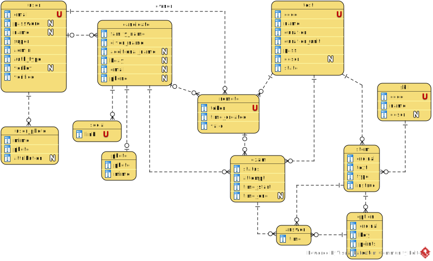

[In english](https://github.com/ciukstar/skillexam/blob/master/README.md)  

[En français](https://github.com/ciukstar/skillexam/blob/master/README.fr.md)  

[На русском](https://github.com/ciukstar/skillexam/blob/master/README.ru.md)

# SkillExam

Aplicația [„SkillExam”](https://skillexamro-i4rimw5qwq-de.a.run.app) oferă o modalitate simplă de a evalua abilitățile candidatului prin intermediul întrebărilor cu răspunsuri multiple.

## Prezentare generală

Abilitățile de evaluat trebuie definite în secțiunea [„Abilități”](https://skillexamro-i4rimw5qwq-de.a.run.app/admin/skills) din grupul „Date”, accesibilă din meniul principal. Abilitățile pot fi considerate ca elemente pentru gruparea întrebărilor unui examen.

Testele de evaluare abilităților unui candidat sunt definite în secțiunea [„Teste”](https://skillexamro-i4rimw5qwq-de.a.run.app/admin/tests) din grupul „Date” din meniul principal. Un Test constă din întrebări.

Candidații la examen sunt înregistrați în secțiunea [„Candidați”](https://skillexamro-i4rimw5qwq-de.a.run.app/admin/candidates) din grupul „Date” din meniul principal.

Un candidat poate alege un examen din lista [„Examene”](https://skillexamro-i4rimw5qwq-de.a.run.app), se poate înscrie la examen și poate începe examenul.

La finalizarea examenului, este oferit un rezumat, iar candidatul poate vedea rezultatele examenului în secțiunea [„Examenele mele”](https://skillexamro-i4rimw5qwq-de.a.run.app/my-exams).

## Entităţile de bază

### Abilitate

O Abilitate este înregistrată în secţiunea [„Abilități”](https://skillexamro-i4rimw5qwq-de.a.run.app/admin/skills) cu un cod unic, un nume şi o descriere.
Candidat

Un Candidat este înregistrat în secțiunea [„Candidați”](https://skillexamro-i4rimw5qwq-de.a.run.app/admin/candidates) furnizând numele complet și, opțional, o fotografie și ziua de naștere.

### Test

Un Test este definit în secțiunea [„Teste”](https://skillexamro-i4rimw5qwq-de.a.run.app/admin/tests) prin furnizarea unui cod unic, a unui nume, opțional o descriere, durata acestuia în minute, nota de trecere.

Se recomandă ca Testul să rămână în starea „Nepublicat” până când este gata de publicare prin definirea și configurarea tuturor subcomponentelor sale: Întrebări și Opțiuni de răspuns.

Un Test este compus din mai multe întrebări.

Un singur test poate acoperi mai multe abilități specifice fiecărei întrebări.

### Întrebare

O Întrebare pentru un anumit test este definită prin furnizarea unui număr ordinal, întrebarea în sine ca text, tipul de întrebare, instrucțiunea și Abilitatea pe care o abordează.

Dacă este necesar, textul Întrebării poate fi formatat cu ```HTML/CSS```.

Tipul unei întrebări poate fi unul dintre „Răspuns unic” sau „Răspuns multiplu”.

Pentru întrebările „Răspuns unic”, candidatului i se cere să selecteze un singur răspuns dintre opțiunile oferite.

Pentru întrebările „Răspuns multiplu”, candidatului i se cere să selecteze toate răspunsurile care sunt corecte dintre opțiunile oferite.

Pentru fiecare întrebare, sunt oferite mai multe opțiuni de răspuns.

### Opțiune

O opțiune de răspuns este introdusă prin furnizarea unui index (ordinal), a unui răspuns ca text, dacă răspunsul este o „cheie” sau un „distractor” și o valoare pentru scor.

Dacă este necesar, textul opțiunii de răspuns poate fi formatat cu ```HTML/CSS```.

După ce toate Opțiunile de răspuns au fost furnizate pentru toate întrebările unui examen, examenul poate fi publicat.

Un Candidat se poate înscrie acum la un examen alegând un test din lista [„Examene”](https://skillexamro-i4rimw5qwq-de.a.run.app).

### Examen

Un Examen reprezintă o anumită instanță a unui Test pentru un Candidat.

El descrie când a început și s-a încheiat examenul pentru un candidat. De asemenea, urmărește numărul de încercări pe care un candidat încearcă să promoveze același test.

După înregistrare, candidatul începe examenul și răspunsurile acestuia sunt înregistrate.

*Diagrama mașinii de stări*


Odată ce timpul de examen a expirat, sistemul îl anunță pe candidat și îl obligă să finalizeze examenul.

### Examen la distanță

Administratorul examenului poate genera o adresă URL pentru un test selectat și, opțional, pentru unul sau mai mulți candidați înregistrați.

Dacă nu este selectat niciun candidat la generarea linkului de examen, destinatarul linkului va fi solicitat să se înregistreze ca și candidat în sistem. În acest caz, înregistrarea utilizatorului nu este necesară.


### Răspuns

Un răspuns reprezintă opțiunea pentru o anumită întrebare pe care un candidat o consideră a fi cea corectă.

## Diagrama entitate-relatie


 
## Demo

[Click aici pentru a vedea demo](https://skillexamro-i4rimw5qwq-de.a.run.app)
